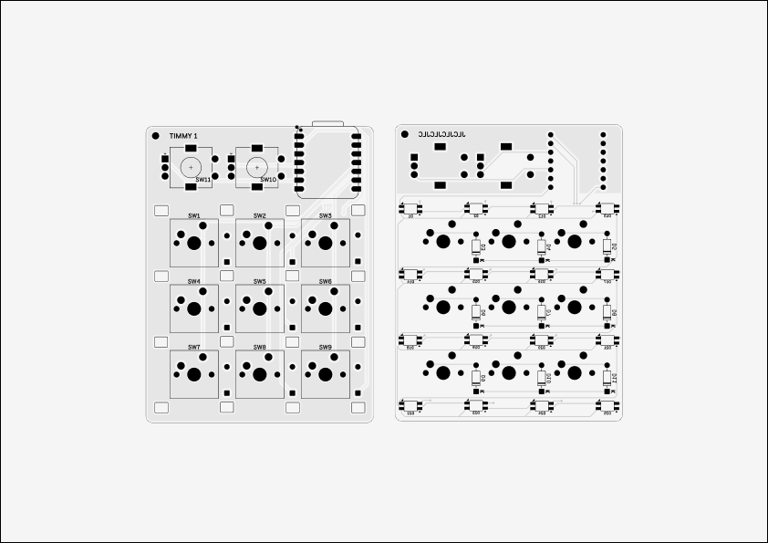

# Timmy

Timmy is a small [hackpad](https://hackpad.hackclub.com/) input device!
It features:

- a custom PCB
- two fun knobs
- 9 keys
- a pretty cool case!

## Parts

Timmy is composed of a case and two knob caps, totaling four
3D-printed pieces (the case top and bottom, a round knob, and a square knob).
It took me a bit to arrive at this design, and I'm quite fond of
it! Everything fits together using heatset inserts for 4 M3 bolts.

## PCB

The PCB was designed in KiCAD. It's my first PCB ever, so it might
not be that great!

This board is double-layered and has a ground copper fill.

## Materials

- 1 Seeed XIAO RP2040
- 9 through-hole 1N4148 Diodes
- 9 MX-Style switches
- 2 EC11 Rotary encoders
- 9 DSA keycaps
- 16 SK6812 MINI-E LEDs
- 4 M3x16mm screws
- 4 M3x5mx4mm heatset inserts
- 4 3D printed parts
- 1 double-layered PCB
